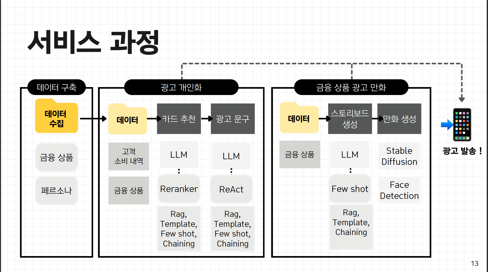
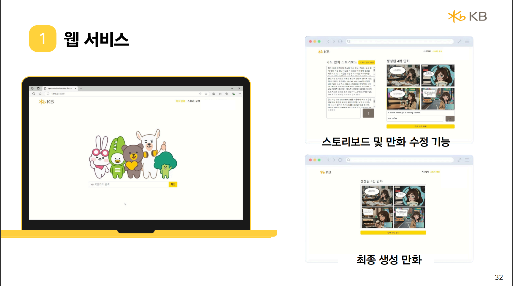
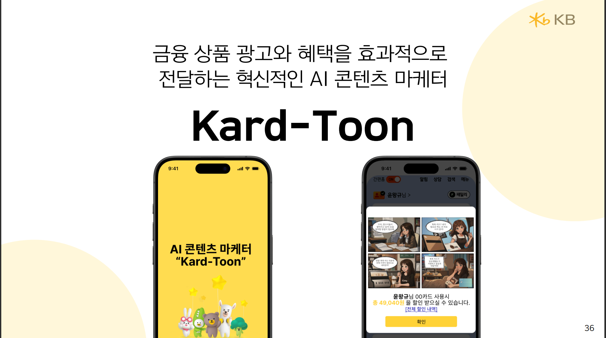

# The 6th KB AI Future Finance Challenge
# 1) 프로젝트 수행 기간
2024년 7월 1일 ~ 8월 11일, 제 6회 KB 국민은행 AI Challenge 제출작 및 딥러닝 부트 캠프 최종 프로젝트
# 2) 프로젝트 개요
대규모 언어 모델(LLM)과 이미지 생성 모델(stable diffusion)을 결합하여 새로운 형태의 마케팅 방식을 제안.
기존의 영상이나 포스터 기반 광고의 한계를 보완하기 위해, **스토리텔링이** **결합된** **'만화 광고'를** 생성하여 더 몰입감 있는 광고 제작.
또한 소비자들이 앱에서 추천하는 금융 상품은 추천 기준이 불명확하여 신뢰하지 못한다는 설문조사와 기존 카드 혜택 설명서의 복잡성을 기인하여 **소비** **내역을** **분석해** **최적의** **카드를** **추천하고**, 그 카드의 혜택을 쉽게 이해할 수 있도록 **초개인화된** **문구를** 생성함.
결론적으로, AI 생성형 모델을 통해 보다 편리하고 KB 금융 상품을 효과적으로 전달하고자 위와 같은 아이디어를 제시하였으며, 마케터들이 실제 활용할 수 있는 웹 페이지 구현과 향후 KB 스타뱅킹 앱에서 구현될 모습도 영상으로 제작함.
# 3) Project Flow

### 0. 데이터 구축
+ :카드_파일_상자: **금융 상품 DB**
셀레니움을 사용해 KB 국민은행 내 카드 상품(체크 카드, 신용 카드)의 '카드 제품' / '카드 소개' / '혜택 내용' 데이터를 수집하여 **총** **157개의** **데이터를** 구축
+ :카드_파일_상자: **고객 내역 DB**
서울 빅데이터 캠패스 '서울시민의 업종별 카드소비 데이터'를 참고하여 **가상의** **페르소나** **Data를** 생성
### 1. 광고 개인화
+ :신용_카드: **카드 상품 추천**
고객 소비 패턴 분석과 고객 소유 카드 혜택 내역을  Response로 받고 Prompt Chaining을 사용하여 고객에게 더 적합한 카드를 추천함.
+ :말풍선: **개인 맞춤 광고 문구 생성**
ReAct 프롬프트 기법을 사용하여 모델이 고객의 이전 소비 이력과 추천 카드 혜택 내용을 바탕으로 정확한 카드 예상 혜택을 계산하여 개인 맞춤 광고 문구를 생성함.
### 2. 금융 광고 만화 생성
+ :클래퍼: **만화 스토리 보드 생성**
스토리 생성 모듈에 만화 스토리보드 예제 Few Shot을 제공하여 스토리 생성에 도움을 줌
+ :액자에_담긴_그림: **만화 장면 생성**
Stable Diffusion을 사용하여 생성된 스토리 보드를 Prompt로 받아 이미지를 생성함.
생성된 이미지에 만화적 요소를 추가하기 위해 Face Detection을 사용하여 만화 주인공의 얼굴 위치를 찾고, 적절한 위치에 말풍선과 글자를 삽입함.
# 4) 기술 스택
:망치와_렌치: AI (Langchain, Torch, Transformer, ComfyUI, Stable Diffusion)
:망치와_렌치: WEB (FastAPI, Uvicon)
### Final Output
:데스크톱_컴퓨터: 카드 만화 광고 생성 및 관리자 수정 기능을 웹으로 구현

:전화_걸기: KB 스타뱅킹 앱에서의 제안 화면

